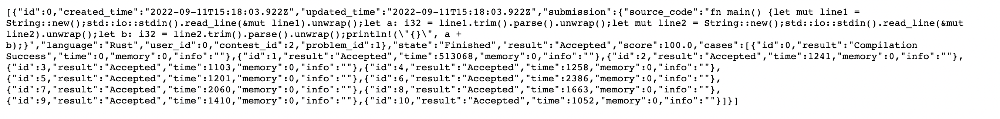
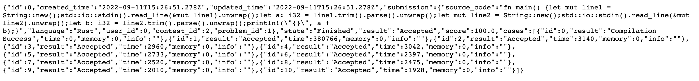

# OJ

## 程序结构和说明

程序的源代码位于/src目录，结构如下：

```bash
├── api
│   ├── contests.rs
│   ├── hello.rs
│   ├── jobs.rs
│   ├── mod.rs
│   └── users.rs
├── args.rs
├── config.rs
└── main.rs
```

其中`main.rs`是程序入口，主函数中用 `actix-web` 启动了一个简单的 HTTP 服务器，监听在 `127.0.0.1:12345` 上，所有后续实现的api都在这里通过`.service`注册。这里还通过`.app_data`维护了两个可以在不同线程之间共享的数据: OJ系统的配置和测评的id。此外，通过`Arc<Mutex<T>`和`lazy_static`实现了三个全局变量：

1. JOB_LIST，存储所有的测评信息，初始为空；
2. USER_LIST，存储所有的用户信息，初始存有一个root用户；
3. CONTEST_LIST，存储所有的比赛信息，初始为空；

在`args`模块中，创建`pub struct Args `用于读取解析命令行参数，可以指定OJ配置以及是否清洗持久化数据。

在`config`模块中，创建`pub struct Config`，上一步读取的存有OJ配置的json文件，就可以反序列化成此结构体进入内存。

下面介绍api部分，`hello`里是模板提供的hello和exit两个api，不作介绍。

在`jobs`模块中，实现了四个与测评任务相关的api：

1. `#[post("/jobs")]`  提交代码以创建一个新的评测任务。
2. `#[get("/jobs")]`  根据 URL 参数查询和筛选评测任务。返回的结果按照任务创建时间升序排序。
3. `#[get("/jobs/{jobid}")]`  获取jobid对应的评测任务的信息。
4. `#[put("/jobs/{jobid}")]`  重新评测jobid对应的评测任务。

在`users`模块中，实现了两个与用户列表相关的api：

1. `#[post("/users")] ` 创建新用户或更新已有用户。
2. `#[get("users")]`  获取用户列表。

在`contests`模块中，实现了四个与多比赛支持相关的api：

1. `#[get("/contests/{contestid}/ranklist")]`  获取单个比赛的排行榜。当contestid为0时，获取全局排行榜。
2. `#[post("/contests")]`  创建新比赛或更新比赛内容。
3. `#[get("/contests")]`  获取比赛列表。
4. `#[get("/contests/{contestid}")]`  获取单个比赛信息。

##  OJ 主要功能说明和截图

按照整个流程进行说明或展示：

1. 使用命令行参数`-c/--config`指定该OJ系统的总配置`config.json`. 配置中指定了本OJ的题库、本OJ支持的所有语言等。

2. 创建用户。

```json
POST http://127.0.0.1:12345/users HTTP/1.1
content-type: application/json

{"name":"user1"}
```

3. 更新用户信息。

```json
POST http://127.0.0.1:12345/users HTTP/1.1
content-type: application/json

{"id":1,"name":"user_1"}
```

4. 获取用户列表。

```json
[{"id":0,"name":"root"},{"id":1,"name":"user_1"}]
```

5. 创建比赛。

```json
POST http://127.0.0.1:12345/contests HTTP/1.1
content-type: application/json

{"from":"2000-01-01T00:00:00.000Z","name":"Contest 1","problem_ids":[0],"submission_limit":1,"to":"2030-01-01T00:00:00.000Z","user_ids":[1]}

POST http://127.0.0.1:12345/contests HTTP/1.1
content-type: application/json

{"from":"2000-01-01T00:00:00.000Z","name":"Contest 2","problem_ids":[1],"submission_limit":1,"to":"2030-01-01T00:00:00.000Z","user_ids":[0]}
```

6. 获取比赛列表。

```json
[
  {
    "id": 1,
    "name": "Contest 1",
    "from": "2000-01-01T00:00:00.000Z",
    "to": "2030-01-01T00:00:00.000Z",
    "problem_ids": [
      0
    ],
    "user_ids": [
      1
    ],
    "submission_limit": 1
  },
  {
    "id": 2,
    "name": "Contest 2",
    "from": "2000-01-01T00:00:00.000Z",
    "to": "2030-01-01T00:00:00.000Z",
    "problem_ids": [
      1
    ],
    "user_ids": [
      0
    ],
    "submission_limit": 1
  }
]
```

6. 获取指定比赛列表。

``` json
GET http://127.0.0.1:12345/contests/1 HTTP/1.1
{
  "id": 1,
  "name": "Contest 1",
  "from": "2000-01-01T00:00:00.000Z",
  "to": "2030-01-01T00:00:00.000Z",
  "problem_ids": [
    0
  ],
  "user_ids": [
    1
  ],
  "submission_limit": 1
}

GET http://127.0.0.1:12345/contests/3 HTTP/1.1
{
  "code": 3,
  "reason": "ERR_NOT_FOUND",
  "message": "Contest 3 not found."
}
```

7. 创建测评任务。

```json
POST http://127.0.0.1:12345/jobs HTTP/1.1
content-type: application/json

{"contest_id":2,"language":"Rust","problem_id":1,"source_code":"fn main() {let mut line1 = String::new();std::io::stdin().read_line(&mut line1).unwrap();let a: i32 = line1.trim().parse().unwrap();let mut line2 = String::new();std::io::stdin().read_line(&mut line2).unwrap();let b: i32 = line2.trim().parse().unwrap();println!(\"{}\", a + b);}","user_id":1}
```

由于比赛2没有user1，创建失败：

```json
{
  "code": 1,
  "reason": "ERR_INVALID_ARGUMENT",
  "message": "HTTP 400 Bad Request"
}
```

新的提交：

```json
POST http://127.0.0.1:12345/jobs HTTP/1.1
content-type: application/json

{"contest_id":2,"language":"Rust","problem_id":1,"source_code":"fn main() {let mut line1 = String::new();std::io::stdin().read_line(&mut line1).unwrap();let a: i32 = line1.trim().parse().unwrap();let mut line2 = String::new();std::io::stdin().read_line(&mut line2).unwrap();let b: i32 = line2.trim().parse().unwrap();println!(\"{}\", a + b);}","user_id":0}
```

创建成功。

新的提交：

```json
POST http://127.0.0.1:12345/jobs HTTP/1.1
content-type: application/json

{"contest_id":2,"language":"Rust","problem_id":1,"source_code":"fn main() {let mut line1 = String::new();std::io::stdin().read_line(&mut line1).unwrap();let a: i32 = line1.trim().parse().unwrap();let mut line2 = String::new();std::io::stdin().read_line(&mut line2).unwrap();let b: i32 = line2.trim().parse().unwrap();println!(\"{}\", a + b);}","user_id":0}
```

由于比赛2指定同一题同一用户最多提交一次，测评失败：

```json
{
  "code": 4,
  "reason": "ERR_RATE_LIMIT",
  "message": "HTTP 400 Bad Request"
}
```

8. 获取测评列表。http://127.0.0.1:12345/jobs：

9. 获取指定ID的测评列表。http://127.0.0.1:12345/jobs/0：

    

10. 获取指定比赛的排行榜。

```json
GET http://127.0.0.1:12345/contests/1/ranklist HTTP/1.1

[{"rank":1,"scores":[0.0],"user":{"id":1,"name":"user1"}}]

GET http://127.0.0.1:12345/contests/2/ranklist HTTP/1.1

[{"rank":1,"scores":[100.0],"user":{"id":0,"name":"root"}}]

GET http://127.0.0.1:12345/contests/0/ranklist HTTP/1.1

[{"user":{"id":0,"name":"root"},"rank":1,"scores":[0.0,100.0]},{"user":{"id":1,"name":"user1"},"rank":2,"scores":[0.0,0.0]}]

```

## 完成此作业感想

本次大作业要实现一个OJ系统的后端，初看起来比较困难，但是仔细想想，OJ系统和大作业里的自动测试本质上不是一样的吗？因此在完成过程中我大量阅读和参考了助教在自动测试部分的源代码，发现其实`common.rs`里就用到了全局变量、`serde`、`Command::new`、错误处理等常见代码块的idiomatic的写法......受益匪浅，不过还有更多更高级的代码没有读懂，希望课程结束以后能继续深入学习Rust搞懂这些代码。另外这两次大作业最大的遗憾就是没能完成提高部分的功能，也希望课程结束以后能继续完善这两个项目。整个小学期上下来，感觉rust语言确实是最难的编程语言之一，对于很多特性其实还处在一个半懂的状态，而且高级一些的语法和特性还无法熟练运用在代码中，不过还是很高兴能成为一个新手rustacean。


### honor code

https://stackoverflow.com/questions/34733811/what-is-the-difference-between-iter-and-into-iter

https://stackoverflow.com/questions/44662312/how-to-filter-a-vector-of-custom-structs

https://stackoverflow.com/questions/58368801/how-do-i-check-if-a-thing-is-in-a-vector

https://rust-lang-nursery.github.io/rust-cookbook/

